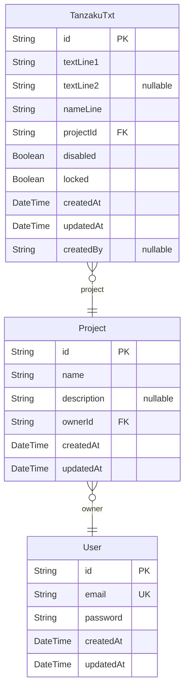

# ERD
> Generated by [`prisma-markdown`](https://github.com/samchon/prisma-markdown)

- [default](#default)

## default

### `Project`

**Properties**
  - `id`: 
  - `name`: 
  - `description`: 
  - `ownerId`: 
  - `createdAt`: 
  - `updatedAt`: 

### `User`

**Properties**
  - `id`: 
  - `email`: 
  - `password`: 
  - `createdAt`: 
  - `updatedAt`: 

### `TanzakuTxt`

**Properties**
  - `id`: 
  - `textLine1`: 
  - `textLine2`: 
  - `nameLine`: 
  - `projectId`: 
  - `disabled`: 
  - `locked`: 
  - `createdAt`: 
  - `updatedAt`: 
  - `createdBy`: 